Multivariant analysis
================

``` r
library(tidyverse)
```

    ## ── Attaching core tidyverse packages ──────────────────────────────────────────────────────────────────────────────────────────────────────────────────────────────────────────────────────────────────────────────────────────────────────────────────────────────────────────────────────────────────────────────────────────────────────────────────────────────────────────────────────────────────────────────── tidyverse 2.0.0 ──
    ## ✔ dplyr     1.1.4     ✔ readr     2.1.5
    ## ✔ forcats   1.0.0     ✔ stringr   1.5.1
    ## ✔ ggplot2   3.5.1     ✔ tibble    3.2.1
    ## ✔ lubridate 1.9.4     ✔ tidyr     1.3.1
    ## ✔ purrr     1.0.4     
    ## ── Conflicts ────────────────────────────────────────────────────────────────────────────────────────────────────────────────────────────────────────────────────────────────────────────────────────────────────────────────────────────────────────────────────────────────────────────────────────────────────────────────────────────────────────────────────────────────────────────────────────────────── tidyverse_conflicts() ──
    ## ✖ dplyr::filter() masks stats::filter()
    ## ✖ dplyr::lag()    masks stats::lag()
    ## ℹ Use the conflicted package (<http://conflicted.r-lib.org/>) to force all conflicts to become errors

``` r
library(performance)
library(flextable)
```

    ## 
    ## Attaching package: 'flextable'
    ## 
    ## The following object is masked from 'package:purrr':
    ## 
    ##     compose

``` r
library(gtsummary)
```

    ## 
    ## Attaching package: 'gtsummary'
    ## 
    ## The following object is masked from 'package:flextable':
    ## 
    ##     continuous_summary

``` r
library(randomForest)
```

    ## randomForest 4.7-1.2
    ## Type rfNews() to see new features/changes/bug fixes.
    ## 
    ## Attaching package: 'randomForest'
    ## 
    ## The following object is masked from 'package:dplyr':
    ## 
    ##     combine
    ## 
    ## The following object is masked from 'package:ggplot2':
    ## 
    ##     margin

``` r
library(equatiomatic)
library(pROC)
```

    ## Type 'citation("pROC")' for a citation.
    ## 
    ## Attaching package: 'pROC'
    ## 
    ## The following objects are masked from 'package:stats':
    ## 
    ##     cov, smooth, var

``` r
library(ggeffects)
library(ggstats)
library(car)
```

    ## Loading required package: carData
    ## 
    ## Attaching package: 'car'
    ## 
    ## The following object is masked from 'package:dplyr':
    ## 
    ##     recode
    ## 
    ## The following object is masked from 'package:purrr':
    ## 
    ##     some

``` r
library(vip)
```

    ## 
    ## Attaching package: 'vip'
    ## 
    ## The following object is masked from 'package:utils':
    ## 
    ##     vi

``` r
library(effectsize)
library(dplyr)
library(caret)
```

    ## Loading required package: lattice
    ## 
    ## Attaching package: 'caret'
    ## 
    ## The following object is masked from 'package:purrr':
    ## 
    ##     lift

``` r
library(gridExtra)
```

    ## 
    ## Attaching package: 'gridExtra'
    ## 
    ## The following object is masked from 'package:randomForest':
    ## 
    ##     combine
    ## 
    ## The following object is masked from 'package:dplyr':
    ## 
    ##     combine

# Multi variant data analysis examples

This is based on the example laid out in the youtube chancel
[here](https://youtu.be/EIR9zN0tDPw?si=TtEUb7i43GCzznIm) We are looking
at the titanic survival chances, based on age , class and sex.

The goal is to have a model which predicts well with multiple variants
the survival chances of different people depending on the associated
factors

``` r
my_data <- carData::TitanicSurvival %>% filter(!(is.na(age)))
glimpse(my_data)
```

    ## Rows: 1,046
    ## Columns: 4
    ## $ survived       <fct> yes, yes, no, no, no, yes, yes, no, yes, no, no, yes, y…
    ## $ sex            <fct> female, male, female, male, female, male, female, male,…
    ## $ age            <dbl> 29.0000, 0.9167, 2.0000, 30.0000, 25.0000, 48.0000, 63.…
    ## $ passengerClass <fct> 1st, 1st, 1st, 1st, 1st, 1st, 1st, 1st, 1st, 1st, 1st, …

first a basic multivariant model with `glm`

``` r
basic_model <- glm(formula = survived ~ sex + age + passengerClass,
                    data   = my_data,
                    family = binomial)
```

Now we need to check if there is linearity of the model

``` r
non_l_model <- mgcv::gam(formula = survived ~ sex + s(age) + passengerClass,
                    data   = my_data,
                    family = binomial)
plot(non_l_model)
```

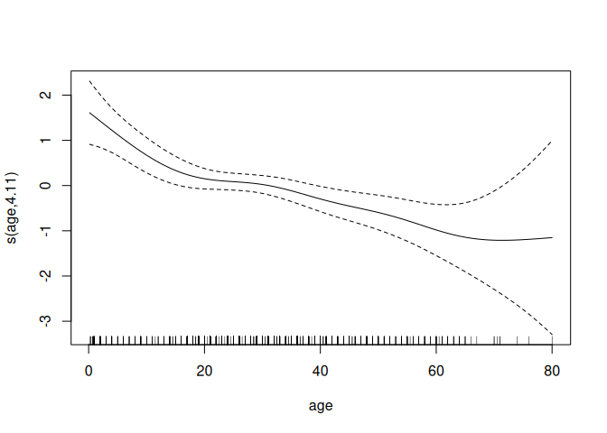<!-- -->

This one is suppsed to check for non-linearity, but it seems not so bad
for age. **Which is the only non-categorical value here**

## Are model assumptions valid

This is a general problem which exists for many situation - is the model
that we use actually applicaple for the situation. Or are certain
conditions not met, e.g. that it is not normal, linear, exponentionally
distributed…

The `check_model` function, recognizes the model and test automatically
the assumptions!

``` r
check_model(basic_model)
```

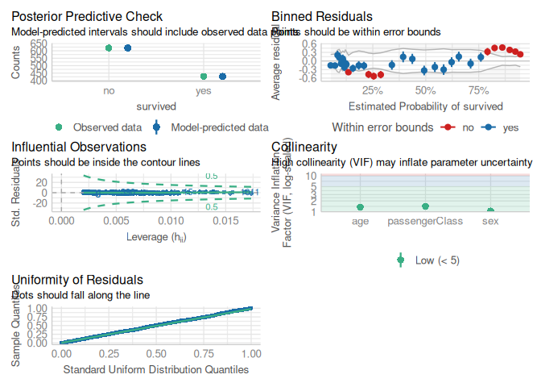<!-- -->

That looks really great and we have not a high colineratiry and values
are quite uniformly distributed. We do see some residues which are
outliers, but the “influential observation” plot shows that the points
are all within the region.

Often variables can depend on each other, e.g. weight and size . This is
in the last check included.

## Predictions

``` r
result1 <- ggeffect(basic_model)
plot(result1$sex)
```

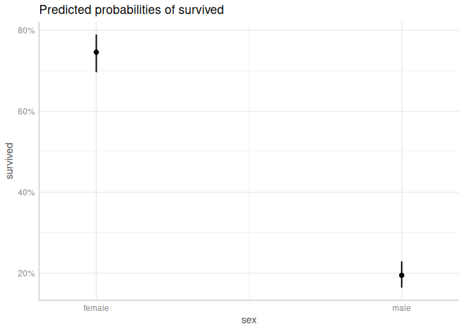<!-- -->

``` r
plot(result1$age)
```

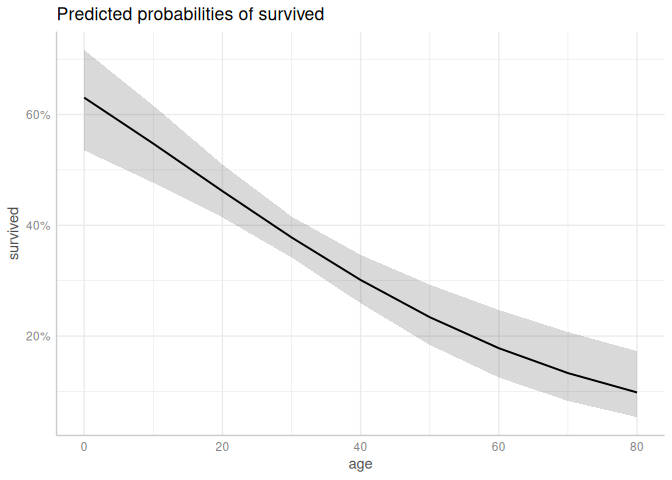<!-- -->

``` r
plot(result1$passengerClass)
```

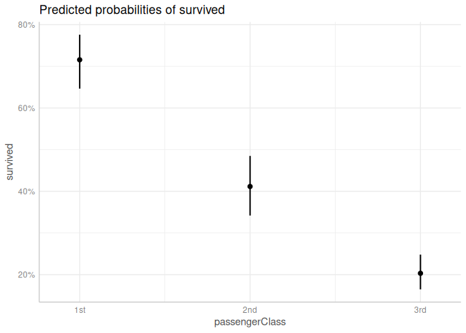<!-- -->

Now these are only the individual factors and their survival
probabilities. But some of them might be linked and giving suddenly very
different probabilities. **IMPOTRANTLY**:by default it adjusts always
over the average of all from the other category. E.g. when looking at
age, it will use the average of all sex and all class automatically.

lets plot/analyze them individually

``` r
effect_plot <- ggeffect(basic_model) %>% plot() %>% sjPlot::plot_grid()
```

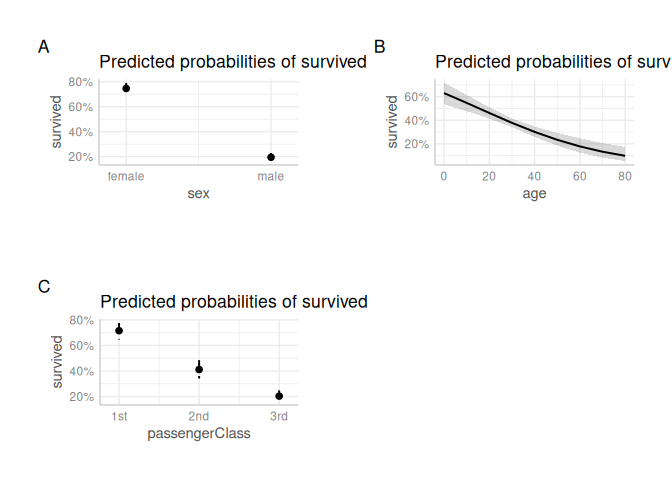<!-- -->

``` r
plot(effect_plot)
```

Nice way of visualization. The conclusion is quite an expected one:

- female people had a higher chance of survival
- the higher the age the lower the chance of survival
- 1st class (which was higher up) survived better than lower class

## Odds ratios between classes within factors

We want to know if the differences are now significant or not.

``` r
summary_table <- tbl_regression(
    basic_model,
    exponentiate            = TRUE, # makes the odd ratio instead of absolute numbers 
    add_pairwise_constrasts = TRUE,
    contrasts_adjust        = "bonferroni",
    pairwise_reverse        = FALSE
)
```

    ## ! `broom::tidy()` failed to tidy the model.

    ## ✔ `tidy_parameters()` used instead.

    ## ℹ Add `tidy_fun = broom.helpers::tidy_parameters` to quiet these messages.

``` r
summary_table
```

<div id="agdggtqurm" style="padding-left:0px;padding-right:0px;padding-top:10px;padding-bottom:10px;overflow-x:auto;overflow-y:auto;width:auto;height:auto;">
<style>#agdggtqurm table {
  font-family: system-ui, 'Segoe UI', Roboto, Helvetica, Arial, sans-serif, 'Apple Color Emoji', 'Segoe UI Emoji', 'Segoe UI Symbol', 'Noto Color Emoji';
  -webkit-font-smoothing: antialiased;
  -moz-osx-font-smoothing: grayscale;
}
&#10;#agdggtqurm thead, #agdggtqurm tbody, #agdggtqurm tfoot, #agdggtqurm tr, #agdggtqurm td, #agdggtqurm th {
  border-style: none;
}
&#10;#agdggtqurm p {
  margin: 0;
  padding: 0;
}
&#10;#agdggtqurm .gt_table {
  display: table;
  border-collapse: collapse;
  line-height: normal;
  margin-left: auto;
  margin-right: auto;
  color: #333333;
  font-size: 16px;
  font-weight: normal;
  font-style: normal;
  background-color: #FFFFFF;
  width: auto;
  border-top-style: solid;
  border-top-width: 2px;
  border-top-color: #A8A8A8;
  border-right-style: none;
  border-right-width: 2px;
  border-right-color: #D3D3D3;
  border-bottom-style: solid;
  border-bottom-width: 2px;
  border-bottom-color: #A8A8A8;
  border-left-style: none;
  border-left-width: 2px;
  border-left-color: #D3D3D3;
}
&#10;#agdggtqurm .gt_caption {
  padding-top: 4px;
  padding-bottom: 4px;
}
&#10;#agdggtqurm .gt_title {
  color: #333333;
  font-size: 125%;
  font-weight: initial;
  padding-top: 4px;
  padding-bottom: 4px;
  padding-left: 5px;
  padding-right: 5px;
  border-bottom-color: #FFFFFF;
  border-bottom-width: 0;
}
&#10;#agdggtqurm .gt_subtitle {
  color: #333333;
  font-size: 85%;
  font-weight: initial;
  padding-top: 3px;
  padding-bottom: 5px;
  padding-left: 5px;
  padding-right: 5px;
  border-top-color: #FFFFFF;
  border-top-width: 0;
}
&#10;#agdggtqurm .gt_heading {
  background-color: #FFFFFF;
  text-align: center;
  border-bottom-color: #FFFFFF;
  border-left-style: none;
  border-left-width: 1px;
  border-left-color: #D3D3D3;
  border-right-style: none;
  border-right-width: 1px;
  border-right-color: #D3D3D3;
}
&#10;#agdggtqurm .gt_bottom_border {
  border-bottom-style: solid;
  border-bottom-width: 2px;
  border-bottom-color: #D3D3D3;
}
&#10;#agdggtqurm .gt_col_headings {
  border-top-style: solid;
  border-top-width: 2px;
  border-top-color: #D3D3D3;
  border-bottom-style: solid;
  border-bottom-width: 2px;
  border-bottom-color: #D3D3D3;
  border-left-style: none;
  border-left-width: 1px;
  border-left-color: #D3D3D3;
  border-right-style: none;
  border-right-width: 1px;
  border-right-color: #D3D3D3;
}
&#10;#agdggtqurm .gt_col_heading {
  color: #333333;
  background-color: #FFFFFF;
  font-size: 100%;
  font-weight: normal;
  text-transform: inherit;
  border-left-style: none;
  border-left-width: 1px;
  border-left-color: #D3D3D3;
  border-right-style: none;
  border-right-width: 1px;
  border-right-color: #D3D3D3;
  vertical-align: bottom;
  padding-top: 5px;
  padding-bottom: 6px;
  padding-left: 5px;
  padding-right: 5px;
  overflow-x: hidden;
}
&#10;#agdggtqurm .gt_column_spanner_outer {
  color: #333333;
  background-color: #FFFFFF;
  font-size: 100%;
  font-weight: normal;
  text-transform: inherit;
  padding-top: 0;
  padding-bottom: 0;
  padding-left: 4px;
  padding-right: 4px;
}
&#10;#agdggtqurm .gt_column_spanner_outer:first-child {
  padding-left: 0;
}
&#10;#agdggtqurm .gt_column_spanner_outer:last-child {
  padding-right: 0;
}
&#10;#agdggtqurm .gt_column_spanner {
  border-bottom-style: solid;
  border-bottom-width: 2px;
  border-bottom-color: #D3D3D3;
  vertical-align: bottom;
  padding-top: 5px;
  padding-bottom: 5px;
  overflow-x: hidden;
  display: inline-block;
  width: 100%;
}
&#10;#agdggtqurm .gt_spanner_row {
  border-bottom-style: hidden;
}
&#10;#agdggtqurm .gt_group_heading {
  padding-top: 8px;
  padding-bottom: 8px;
  padding-left: 5px;
  padding-right: 5px;
  color: #333333;
  background-color: #FFFFFF;
  font-size: 100%;
  font-weight: initial;
  text-transform: inherit;
  border-top-style: solid;
  border-top-width: 2px;
  border-top-color: #D3D3D3;
  border-bottom-style: solid;
  border-bottom-width: 2px;
  border-bottom-color: #D3D3D3;
  border-left-style: none;
  border-left-width: 1px;
  border-left-color: #D3D3D3;
  border-right-style: none;
  border-right-width: 1px;
  border-right-color: #D3D3D3;
  vertical-align: middle;
  text-align: left;
}
&#10;#agdggtqurm .gt_empty_group_heading {
  padding: 0.5px;
  color: #333333;
  background-color: #FFFFFF;
  font-size: 100%;
  font-weight: initial;
  border-top-style: solid;
  border-top-width: 2px;
  border-top-color: #D3D3D3;
  border-bottom-style: solid;
  border-bottom-width: 2px;
  border-bottom-color: #D3D3D3;
  vertical-align: middle;
}
&#10;#agdggtqurm .gt_from_md > :first-child {
  margin-top: 0;
}
&#10;#agdggtqurm .gt_from_md > :last-child {
  margin-bottom: 0;
}
&#10;#agdggtqurm .gt_row {
  padding-top: 8px;
  padding-bottom: 8px;
  padding-left: 5px;
  padding-right: 5px;
  margin: 10px;
  border-top-style: solid;
  border-top-width: 1px;
  border-top-color: #D3D3D3;
  border-left-style: none;
  border-left-width: 1px;
  border-left-color: #D3D3D3;
  border-right-style: none;
  border-right-width: 1px;
  border-right-color: #D3D3D3;
  vertical-align: middle;
  overflow-x: hidden;
}
&#10;#agdggtqurm .gt_stub {
  color: #333333;
  background-color: #FFFFFF;
  font-size: 100%;
  font-weight: initial;
  text-transform: inherit;
  border-right-style: solid;
  border-right-width: 2px;
  border-right-color: #D3D3D3;
  padding-left: 5px;
  padding-right: 5px;
}
&#10;#agdggtqurm .gt_stub_row_group {
  color: #333333;
  background-color: #FFFFFF;
  font-size: 100%;
  font-weight: initial;
  text-transform: inherit;
  border-right-style: solid;
  border-right-width: 2px;
  border-right-color: #D3D3D3;
  padding-left: 5px;
  padding-right: 5px;
  vertical-align: top;
}
&#10;#agdggtqurm .gt_row_group_first td {
  border-top-width: 2px;
}
&#10;#agdggtqurm .gt_row_group_first th {
  border-top-width: 2px;
}
&#10;#agdggtqurm .gt_summary_row {
  color: #333333;
  background-color: #FFFFFF;
  text-transform: inherit;
  padding-top: 8px;
  padding-bottom: 8px;
  padding-left: 5px;
  padding-right: 5px;
}
&#10;#agdggtqurm .gt_first_summary_row {
  border-top-style: solid;
  border-top-color: #D3D3D3;
}
&#10;#agdggtqurm .gt_first_summary_row.thick {
  border-top-width: 2px;
}
&#10;#agdggtqurm .gt_last_summary_row {
  padding-top: 8px;
  padding-bottom: 8px;
  padding-left: 5px;
  padding-right: 5px;
  border-bottom-style: solid;
  border-bottom-width: 2px;
  border-bottom-color: #D3D3D3;
}
&#10;#agdggtqurm .gt_grand_summary_row {
  color: #333333;
  background-color: #FFFFFF;
  text-transform: inherit;
  padding-top: 8px;
  padding-bottom: 8px;
  padding-left: 5px;
  padding-right: 5px;
}
&#10;#agdggtqurm .gt_first_grand_summary_row {
  padding-top: 8px;
  padding-bottom: 8px;
  padding-left: 5px;
  padding-right: 5px;
  border-top-style: double;
  border-top-width: 6px;
  border-top-color: #D3D3D3;
}
&#10;#agdggtqurm .gt_last_grand_summary_row_top {
  padding-top: 8px;
  padding-bottom: 8px;
  padding-left: 5px;
  padding-right: 5px;
  border-bottom-style: double;
  border-bottom-width: 6px;
  border-bottom-color: #D3D3D3;
}
&#10;#agdggtqurm .gt_striped {
  background-color: rgba(128, 128, 128, 0.05);
}
&#10;#agdggtqurm .gt_table_body {
  border-top-style: solid;
  border-top-width: 2px;
  border-top-color: #D3D3D3;
  border-bottom-style: solid;
  border-bottom-width: 2px;
  border-bottom-color: #D3D3D3;
}
&#10;#agdggtqurm .gt_footnotes {
  color: #333333;
  background-color: #FFFFFF;
  border-bottom-style: none;
  border-bottom-width: 2px;
  border-bottom-color: #D3D3D3;
  border-left-style: none;
  border-left-width: 2px;
  border-left-color: #D3D3D3;
  border-right-style: none;
  border-right-width: 2px;
  border-right-color: #D3D3D3;
}
&#10;#agdggtqurm .gt_footnote {
  margin: 0px;
  font-size: 90%;
  padding-top: 4px;
  padding-bottom: 4px;
  padding-left: 5px;
  padding-right: 5px;
}
&#10;#agdggtqurm .gt_sourcenotes {
  color: #333333;
  background-color: #FFFFFF;
  border-bottom-style: none;
  border-bottom-width: 2px;
  border-bottom-color: #D3D3D3;
  border-left-style: none;
  border-left-width: 2px;
  border-left-color: #D3D3D3;
  border-right-style: none;
  border-right-width: 2px;
  border-right-color: #D3D3D3;
}
&#10;#agdggtqurm .gt_sourcenote {
  font-size: 90%;
  padding-top: 4px;
  padding-bottom: 4px;
  padding-left: 5px;
  padding-right: 5px;
}
&#10;#agdggtqurm .gt_left {
  text-align: left;
}
&#10;#agdggtqurm .gt_center {
  text-align: center;
}
&#10;#agdggtqurm .gt_right {
  text-align: right;
  font-variant-numeric: tabular-nums;
}
&#10;#agdggtqurm .gt_font_normal {
  font-weight: normal;
}
&#10;#agdggtqurm .gt_font_bold {
  font-weight: bold;
}
&#10;#agdggtqurm .gt_font_italic {
  font-style: italic;
}
&#10;#agdggtqurm .gt_super {
  font-size: 65%;
}
&#10;#agdggtqurm .gt_footnote_marks {
  font-size: 75%;
  vertical-align: 0.4em;
  position: initial;
}
&#10;#agdggtqurm .gt_asterisk {
  font-size: 100%;
  vertical-align: 0;
}
&#10;#agdggtqurm .gt_indent_1 {
  text-indent: 5px;
}
&#10;#agdggtqurm .gt_indent_2 {
  text-indent: 10px;
}
&#10;#agdggtqurm .gt_indent_3 {
  text-indent: 15px;
}
&#10;#agdggtqurm .gt_indent_4 {
  text-indent: 20px;
}
&#10;#agdggtqurm .gt_indent_5 {
  text-indent: 25px;
}
&#10;#agdggtqurm .katex-display {
  display: inline-flex !important;
  margin-bottom: 0.75em !important;
}
&#10;#agdggtqurm div.Reactable > div.rt-table > div.rt-thead > div.rt-tr.rt-tr-group-header > div.rt-th-group:after {
  height: 0px !important;
}
</style>
<table class="gt_table" data-quarto-disable-processing="false" data-quarto-bootstrap="false">
  <thead>
    <tr class="gt_col_headings">
      <th class="gt_col_heading gt_columns_bottom_border gt_left" rowspan="1" colspan="1" scope="col" id="label"><span class='gt_from_md'><strong>Characteristic</strong></span></th>
      <th class="gt_col_heading gt_columns_bottom_border gt_center" rowspan="1" colspan="1" scope="col" id="estimate"><span class='gt_from_md'><strong>OR</strong></span></th>
      <th class="gt_col_heading gt_columns_bottom_border gt_center" rowspan="1" colspan="1" scope="col" id="conf.low"><span class='gt_from_md'><strong>95% CI</strong></span></th>
      <th class="gt_col_heading gt_columns_bottom_border gt_center" rowspan="1" colspan="1" scope="col" id="p.value"><span class='gt_from_md'><strong>p-value</strong></span></th>
    </tr>
  </thead>
  <tbody class="gt_table_body">
    <tr><td headers="label" class="gt_row gt_left">sex</td>
<td headers="estimate" class="gt_row gt_center"><br /></td>
<td headers="conf.low" class="gt_row gt_center"><br /></td>
<td headers="p.value" class="gt_row gt_center"><br /></td></tr>
    <tr><td headers="label" class="gt_row gt_left">    female</td>
<td headers="estimate" class="gt_row gt_center">—</td>
<td headers="conf.low" class="gt_row gt_center">—</td>
<td headers="p.value" class="gt_row gt_center"><br /></td></tr>
    <tr><td headers="label" class="gt_row gt_left">    male</td>
<td headers="estimate" class="gt_row gt_center">0.08</td>
<td headers="conf.low" class="gt_row gt_center">0.06, 0.11</td>
<td headers="p.value" class="gt_row gt_center"><0.001</td></tr>
    <tr><td headers="label" class="gt_row gt_left">age</td>
<td headers="estimate" class="gt_row gt_center">0.97</td>
<td headers="conf.low" class="gt_row gt_center">0.95, 0.98</td>
<td headers="p.value" class="gt_row gt_center"><0.001</td></tr>
    <tr><td headers="label" class="gt_row gt_left">passengerClass</td>
<td headers="estimate" class="gt_row gt_center"><br /></td>
<td headers="conf.low" class="gt_row gt_center"><br /></td>
<td headers="p.value" class="gt_row gt_center"><br /></td></tr>
    <tr><td headers="label" class="gt_row gt_left">    1st</td>
<td headers="estimate" class="gt_row gt_center">—</td>
<td headers="conf.low" class="gt_row gt_center">—</td>
<td headers="p.value" class="gt_row gt_center"><br /></td></tr>
    <tr><td headers="label" class="gt_row gt_left">    2nd</td>
<td headers="estimate" class="gt_row gt_center">0.28</td>
<td headers="conf.low" class="gt_row gt_center">0.18, 0.43</td>
<td headers="p.value" class="gt_row gt_center"><0.001</td></tr>
    <tr><td headers="label" class="gt_row gt_left">    3rd</td>
<td headers="estimate" class="gt_row gt_center">0.10</td>
<td headers="conf.low" class="gt_row gt_center">0.06, 0.16</td>
<td headers="p.value" class="gt_row gt_center"><0.001</td></tr>
  </tbody>
  <tfoot class="gt_sourcenotes">
    <tr>
      <td class="gt_sourcenote" colspan="4"><span class='gt_from_md'>Abbreviations: CI = Confidence Interval, OR = Odds Ratio</span></td>
    </tr>
  </tfoot>
  &#10;</table>
</div>

``` r
plot(summary_table)
```

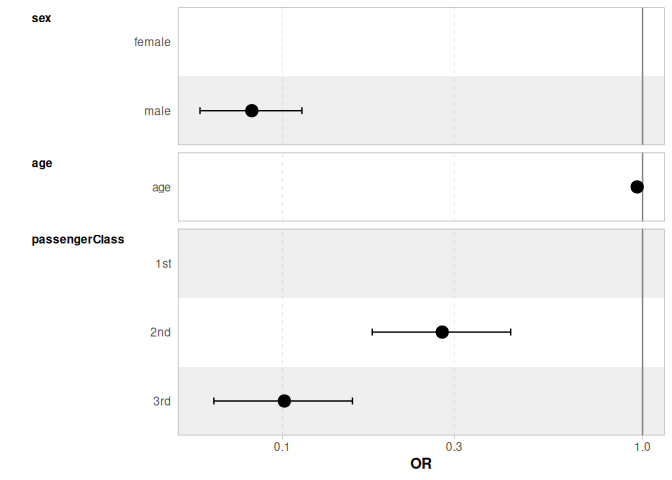<!-- -->

## Importance of values

If we want to find the most important ones within all these significant
ones here we need to go further. For this, a type II test is being used.

``` r
car::Anova(basic_model)
```

    ## Analysis of Deviance Table (Type II tests)
    ## 
    ## Response: survived
    ##                LR Chisq Df Pr(>Chisq)    
    ## sex             273.239  1  < 2.2e-16 ***
    ## age              31.344  1  2.161e-08 ***
    ## passengerClass  118.886  2  < 2.2e-16 ***
    ## ---
    ## Signif. codes:  0 '***' 0.001 '**' 0.01 '*' 0.05 '.' 0.1 ' ' 1

Here it suggests that sex is very important and significant, as well for
class. The age is though less important

## Random forest classifier

Now we want to try using a more “sophisticated” model instead.

``` r
randomF_model <- randomForest(
    survived ~ sex + age + passengerClass,
    data = my_data
)
vip(randomF_model)
```

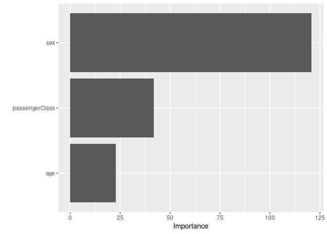<!-- -->

Surprise, we get similarly a ranking of importance of the different
factors and very similar results

# Model to data fit

``` r
perf_basic <- performance(basic_model)
perf_basic
```

    ## # Indices of model performance
    ## 
    ## AIC     |    AICc |      BIC | Tjur's R2 |  RMSE | Sigma | Log_loss | Score_log
    ## -------------------------------------------------------------------------------
    ## 992.453 | 992.511 | 1017.217 |     0.376 | 0.387 | 1.000 |    0.470 |      -Inf
    ## 
    ## AIC     | Score_spherical |   PCP
    ## ---------------------------------
    ## 992.453 |           0.001 | 0.699

``` r
#performance(randomF_model)
```

The R2 value is only 0.3762437 what does it mean ? It means our 3
predictors explain almost 38% of the variance and this is substantial
(\>26% is substantial)

Unfortunately, we cant use the same function for the random forest
model. But what we can do instead is making the predictions from both
models for survival and then evaluate the confusion matrix.

Note: with the glm model we get probabilities, whereas the random forest
model already predicts a yes/no case.

``` r
predict_basic    <- predict.glm(basic_model,my_data)
my_data$glm_pred <- as.factor(case_when( predict_basic > 0.5 ~ "yes", .default="no"))
my_data$rf_pred  <- predict(randomF_model,my_data)
```

## ROC curve

So now we want to asses how good the model is to predict the values and
measure the area under the curve (AUC). Above 0.8 is a great model \<
0.5 is worse than random.

``` r
roc_result <- roc(survived ~ fitted.values(basic_model),
    data = my_data,
    plot=TRUE,
    legacy.axes = TRUE,
    print.auc = TRUE,
    ci = TRUE)
```

    ## Setting levels: control = no, case = yes

    ## Setting direction: controls < cases

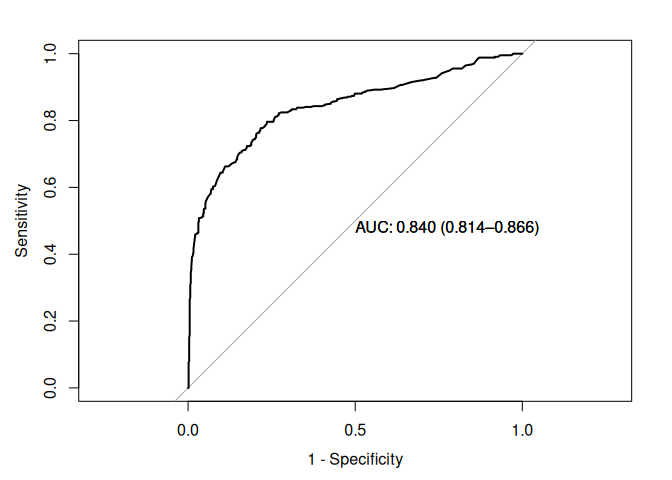<!-- -->

We have an AUC of 0.8400627 which is actually great. Again ROC with the
random forest model wont work

## Confusion matrix

``` r
glm_cmatrix <- confusionMatrix(reference=my_data$survived,data=my_data$glm_pred)
rf_cmatrix  <- confusionMatrix(reference=my_data$survived,data=my_data$rf_pred)

glm_cmatrix
```

    ## Confusion Matrix and Statistics
    ## 
    ##           Reference
    ## Prediction  no yes
    ##        no  569 169
    ##        yes  50 258
    ##                                           
    ##                Accuracy : 0.7906          
    ##                  95% CI : (0.7647, 0.8149)
    ##     No Information Rate : 0.5918          
    ##     P-Value [Acc > NIR] : < 2.2e-16       
    ##                                           
    ##                   Kappa : 0.5471          
    ##                                           
    ##  Mcnemar's Test P-Value : 1.54e-15        
    ##                                           
    ##             Sensitivity : 0.9192          
    ##             Specificity : 0.6042          
    ##          Pos Pred Value : 0.7710          
    ##          Neg Pred Value : 0.8377          
    ##              Prevalence : 0.5918          
    ##          Detection Rate : 0.5440          
    ##    Detection Prevalence : 0.7055          
    ##       Balanced Accuracy : 0.7617          
    ##                                           
    ##        'Positive' Class : no              
    ## 

``` r
rf_cmatrix
```

    ## Confusion Matrix and Statistics
    ## 
    ##           Reference
    ## Prediction  no yes
    ##        no  576 146
    ##        yes  43 281
    ##                                           
    ##                Accuracy : 0.8193          
    ##                  95% CI : (0.7946, 0.8422)
    ##     No Information Rate : 0.5918          
    ##     P-Value [Acc > NIR] : < 2.2e-16       
    ##                                           
    ##                   Kappa : 0.6115          
    ##                                           
    ##  Mcnemar's Test P-Value : 1.176e-13       
    ##                                           
    ##             Sensitivity : 0.9305          
    ##             Specificity : 0.6581          
    ##          Pos Pred Value : 0.7978          
    ##          Neg Pred Value : 0.8673          
    ##              Prevalence : 0.5918          
    ##          Detection Rate : 0.5507          
    ##    Detection Prevalence : 0.6902          
    ##       Balanced Accuracy : 0.7943          
    ##                                           
    ##        'Positive' Class : no              
    ## 

``` r
fourfoldplot(as.table(glm_cmatrix), color=c("orange","steelblue"), main="Confusion matrix: glm")
```

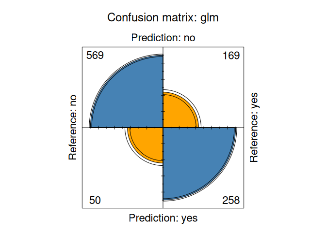<!-- -->

``` r
fourfoldplot(as.table(rf_cmatrix), color=c("orange","steelblue"),main="Confusion matrix: random forest")
```

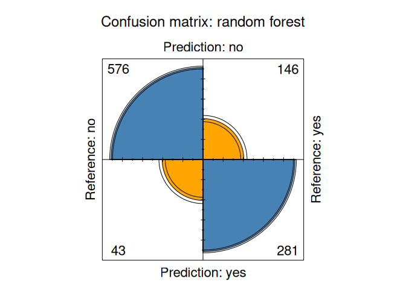<!-- -->

We can see that the random forest classification is slightly better than
the Multivariable Logistic Regression. This is reflected e.g. in the
accuracy of 0.8193117 for random forest and 0.790631 for the glm.
Whereas sensitivity is very similar with a delta of only 0.0113086 , the
difference in specificity is much higher with 0.0538642.
